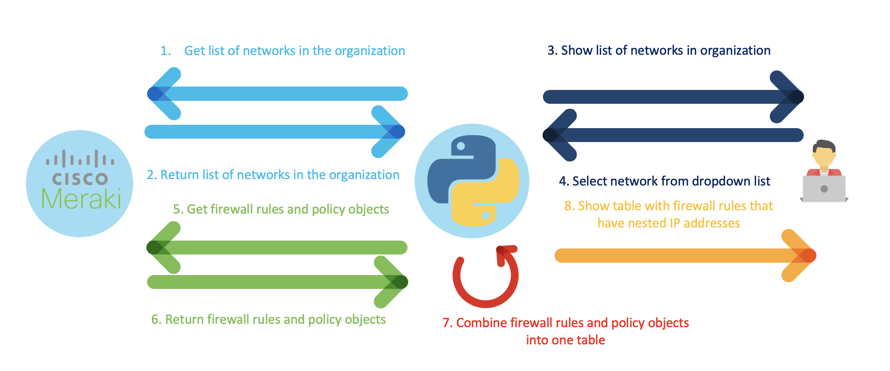
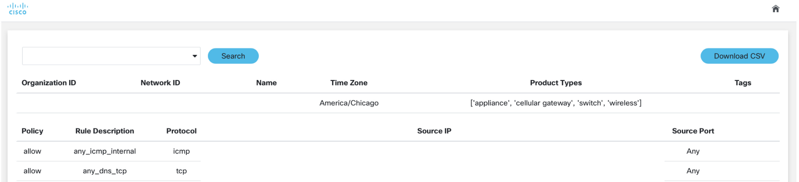

# GVE Devnet: Cisco Meraki MX Dashboard

## Contacts
* Eda Akturk (eakturk@cisco.com)
* Simon Fang (sifang@cisco.com)

## Solution Components
*  Python 3.8
*  Flask
*  Cisco Meraki
    - [API Documentation](https://developer.cisco.com/meraki/api-v1/)


## Solution Overview
The solution creates a flask application that allows to view MX FW rules and download to a csv from a single dashboard.



1. When initializing the flask application, we immediately make a GET request to the Meraki Dashboard API
2. The Meraki Dashboard API responds with a list of networks part of the organization
3. The flask application shows the a list of networks in the organization in a dropdown menu
4. The user selects a network from the dropdown menu
5. The flask application makes two GET requests to the Meraki Dashboard API to obtain the L3 firewall rules and policy objects that are part of the network
6. The Meraki Dashboard API returns both responses
7. The flask application combines the L3 firewall rules and the policy objects into one table
8. The flask application shows the table with the firewall rules and the nested IP addresses

The front-end of the application looks as follows:



For details please view "Usage" below. 

## Installation/Configuration

#### Clone the repo :
```$ git clone (link)```

#### *(Optional) Create Virtual Environment :*
Initialize a virtual environment 

```virtualenv venv```

Activate the virtual env

*Windows*   ``` venv\Scripts\activate```

*Linux* ``` source venv/bin/activate```

#### Install the libraries :

```$ pip install -r requirements.txt```


## Setup: 

*Cisco Meraki*
1. Add the Meraki API Key and Organization Id to env_var.py
```
config = {}

config['api_key'] = ""
config['organization_id'] = ""
```

## Usage
Run the flask application:
```
python main.py
```

Go to the following url:
```
https://localhost:8000/
```

### LICENSE

Provided under Cisco Sample Code License, for details see [LICENSE](LICENSE.md)

### CODE_OF_CONDUCT

Our code of conduct is available [here](CODE_OF_CONDUCT.md)

### CONTRIBUTING

See our contributing guidelines [here](CONTRIBUTING.md)

#### DISCLAIMER:
<b>Please note:</b> This script is meant for demo purposes only. All tools/ scripts in this repo are released for use "AS IS" without any warranties of any kind, including, but not limited to their installation, use, or performance. Any use of these scripts and tools is at your own risk. There is no guarantee that they have been through thorough testing in a comparable environment and we are not responsible for any damage or data loss incurred with their use.
You are responsible for reviewing and testing any scripts you run thoroughly before use in any non-testing environment.
